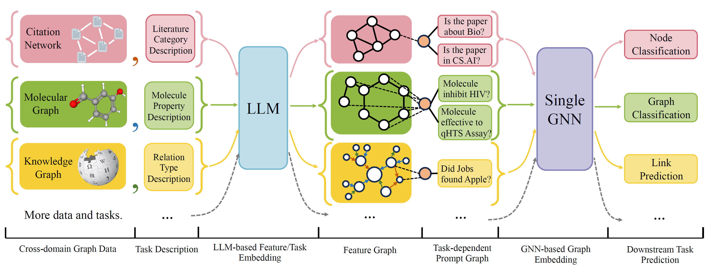

# Code for *One for All: Towards Training One Graph Model for All Classification Tasks*

Paper: [https://arxiv.org/abs/2310.00149](https://arxiv.org/abs/2310.00149)

Authors: Hao Liu, Jiarui Feng, Lecheng Kong, Ningyue Liang, Dacheng Tao, Yixin Chen, Muhan Zhang



OFA is a general Graph Classification Framework that can solves a wide range of graph classification tasks with a single
model and a single set of parameters. The tasks are cross-domain (e.g. citation network, molecular graph,...) and
cross-tasks (e.g. few-shot, zero-shot, graph-level, node-leve,...)

OFA use natural languages to describe all graphs, and use a LLM to embed all description in the same embedding space,
which enable cross-domain training using a single model.

OFA propose a prompting paradiagm that all task information are converted to prompt graph. So subsequence model is able
to read tasks information and predict relavent target accordingly, without having to adjust model parameters and
architecture. Hence, a single model can be cross-task.

OFA curated a list of graph datasets from a different sources and domains and describe nodes/edges in the graphs with a
systematical decription protocol. We thank previous works
including, [OGB](https://ogb.stanford.edu/), [GIMLET](https://github.com/zhao-ht/GIMLET/tree/master), [MoleculeNet](https://arxiv.org/abs/1703.00564), [GraphLLM](https://arxiv.org/pdf/2307.03393.pdf),
and [villmow](https://github.com/villmow/datasets_knowledge_embedding/tree/master) for providing wonderful raw
graph/text data that make our work possible.

## 🔥News

OneForAll underwent a major revision, where we cleaned up the code and fixed several reported bugs. The major updates
are:

- Use yaml configs to specify tasks, see [Configuration Section](#configuration-explained) for details.
- Updated graph prompting logic, where users can design their own prompting more freely.
- Use only one Few-shot dataset for few-shot prompting of different levels of tasks.

If you previously used our repository, please pull and delete the old generated feature/text files and regenerate. Sorry
for the inconvenience.

## Requirements

To install requirement for the project using conda:

```
conda env create -f environment.yml
```

## E2E experiments

For joint end-to-end experiments on all collected dataset, run

```
python run_cdm.py --override e2e_all_config.yaml
```

All arguments can be changed by space separated values such as

```
python run_cdm.py --override e2e_all_config.yaml num_layers 7 batch_size 512 dropout 0.15 JK none
```

Users can modify the `task_names` variable in `./e2e_all_config.yaml` to control which datasets are included during
training. The length of `task_names`, `d_multiple`, and `d_min_ratio` should be the same. They can also be specified in
command line arguments by comma separated values.

e.g.

```
python run_cdm.py task_names cora_link,arxiv d_multiple 1,1 d_min_ratio 1,1
```

OFA-ind can be specified by

```
python run_cdm.py task_names cora_link d_multiple 1 d_min_ratio 1
```

## Low resource experiments

To run the few-shot and zero-shot experiments

```
python run_cdm.py --override lr_all_config.yaml
```

## Configuration explained

We define configurations for each task, each task configurations contains several datasets configurations.

Task configurations are stored in `./configs/task_config.yaml`. A task usually consists several splits of datasets (not
necessarily same datasets). For example, a regular end-to-end Cora node classification task will have the train split of
the Cora dataset as the train dataset, the valid split of the Cora dataset as one of the valid dataset, and likewise for
the test split. You can also have more validation/test by specifying the train split of the Cora as one of the
validation/test datasets. Specifically, a task configuration looks like

```yaml
arxiv:
  eval_pool_mode: mean
  dataset: arxiv             # dataset name
  eval_set_constructs:
    - stage: train           # a task should have one and only one train stage dataset
      split_name: train
    - stage: valid
      split_name: valid
      dataset: cora          # replace the default dataset for zero-shot tasks
    - stage: valid
      split_name: valid
    - stage: test
      split_name: test
    - stage: test
      split_name: train      # test the train split
```

Dataset configurations are stored in `./configs/task_config.yaml`. A dataset configuration defines how a dataset is
constructed. Specifically,

```yaml
arxiv:
  task_level: e2e_node
  preprocess: null                       # name of the preprocess function defined in task_constructor.py
  construct: ConstructNodeCls            # name of the dataset construction function defined in task_constructor.py
  args: # additional arguments to construct function
    walk_length: null
    single_prompt_edge: True
  eval_metric: acc                       # evaluation metric
  eval_func: classification_func         # evaluation function that process model output and batch to input to evaluator
  eval_mode: max                         # evaluation mode (min/max)
  dataset_name: arxiv                    # name of the OFAPygDataset
  dataset_splitter: ArxivSplitter        # splitting function defined in task_constructor.py
  process_label_func: process_pth_label  # name of process label function that transform original label to the binary labels
  num_classes: 40 
```